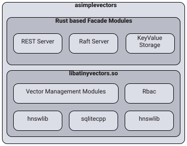

## Overview

[asimplevectors](https://docs.asimplevectors.com/) is a high-performance vector database optimized for retrieval-augmented generation (RAG). It provides fast and reliable clustering through Rust and the Raft consensus protocol, while leveraging SQLite3 for easy data management. Additionally, the database includes built-in key-value storage for managing original document data within the vector database.

## Key Advantages

- **Optimized for RAG**: Built to handle RAG tasks efficiently.
- **Fast and Reliable Clustering**: Uses Rust and the Raft consensus protocol to deliver a highly performant clustering system.
- **Easy Data Management**: Utilizes SQLite3 for simple and effective data organization.
- **Integrated Key-Value Storage**: Manage original document data alongside vectors with the built-in key-value store.

## Features

- **Version Management**: Includes support for version control, with A/B testing capabilities.
- **Key-Value Storage**: Built-in key-value storage functionality.
- **Snapshot Support**: Offers snapshot capabilities for data backups and state saving.
- **Dense & Sparse Vector Management**: Handles both dense and sparse vector types.

## Docs

For detailed development guidelines and documentation, please refer to the official guide at [https://docs.asimplevectors.com/](https://docs.asimplevectors.com/).

## Architecture

This project is built with Raft consensus to achieve clustering. It leverages components such as [atinyvectors](https://github.com/billionvectors/atinyvectors) (written in C++), hnswlib, and SQLite3 to provide high-performance vector management and clustering capabilities.



## How to Run Examples

1. Run `install_dependency.sh` to install necessary dependencies.
2. Copy .env.local file to .env
3. Execute `./run_example.sh search` and select a test file under the `example/` directory.
-> search, security, snapshot, space, vector, version

## How to Run

1. Install dependencies: `./install_dependency.sh`
2. Build the project: `./build.sh --release`
3. Copy .env.local file to .env
4. Start the vector database node:
```bash
./asimplevectors --id 1 --http-addr 127.0.0.1:21001 --rpc-addr 127.0.0.1:22001 &
```
5. Initialize the cluster with the following curl command:
```bash
curl --silent "127.0.0.1:21001/cluster/init" -H "Content-Type: application/json" -d '{}'
```
## Docker Run

```bash
docker build --build-arg BUILD_TYPE=Release -t asimplevectors .
docker run -p 21001:21001 -p 21002:21002 asimplevectors &
curl --silent "127.0.0.1:21001/cluster/init" -H "Content-Type: application/json" -d '{}'
```

## Clustering
```bash
docker build --build-arg BUILD_TYPE=Release -t asimplevectors .
docker run -p 21001:21001 -p 21002:21002 asimplevectors --id 1 &
curl --silent "127.0.0.1:21001/cluster/init" -H "Content-Type: application/json" -d '{}'

docker run -p 22001:21001 -p 22002:21002 asimplevectors --id 2 &
docker run -p 23001:21001 -p 23002:21002 asimplevectors --id 3 &

# register new cluster
curl --silent "127.0.0.1:21001/cluster/add-learner" -H "Content-Type: application/json" -d '[2, "127.0.0.1:22001", "127.0.0.1:22002"]'
curl --silent "127.0.0.1:21001/cluster/add-learner" -H "Content-Type: application/json" -d '[3, "127.0.0.1:23001", "127.0.0.1:23001"]'
curl --silent "127.0.0.1:21001/cluster/metrics"
```
This adds a clear note about Raft's recommendation for an odd number of nodes but also specifies that two nodes will still work.


## Supported Metrics
`asimplevectors` supports multiple distance metrics to handle a variety of use cases, offering flexibility in how vectors are compared.
- **L2 Distance (Euclidean Distance)**
- **Cosine Similarity**
- **Inner Product (Dot Product)**

## C API
If you want the C API, please visit [atinyvectors](https://github.com/billionvectors/atinyvectors).

## License

For details, please refer to the `LICENSE` file.

## Support

If you're interested in forming a business partnership with us, please send an email to [support@billionvectors.com](mailto:support@billionvectors.com).
